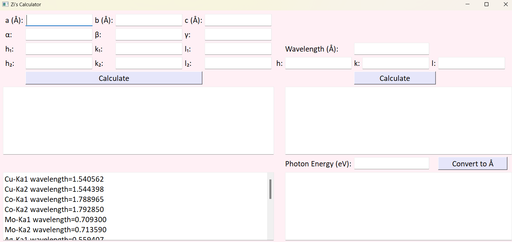

# Bragg Calculator Version 1.23

This is a Python GUI containing a few calculators:
- Photon energy to wavelength conversion

For given lattice parameters, it calculates:
- The angle between two hkl
- d-spacing and two theta for a given hkl

## Install
- Download the GUI folder
- Run _Zi_cal_ver1p23.py_ in Spyder

## Note
- The GUI is more user-friendly if your computer is using light mode.
- The GUI will run in the terminal but will collapse if you calculate with empty cells. However, it won't collapse if you run it in Spyder. I don't want to fix that bug :ghost:

## Remark
My code is like a three-legged horse, t is not a fully functioning horse, but it can run :smirk_cat:

This code is created with extensive help from AI.

